# Law Firm Publications Scraper Suite 📚⚖️

A comprehensive collection of web scrapers designed to aggregate and analyze publications, articles, newsletters, and thought leadership content from major Indian law firms. This project enables tracking of legal industry trends, competitive analysis, and insights into how law firms engage with their clients through published content.

[](https://www.python.org/downloads/)
[](LICENSE)
[](https://www.mysql.com/)
[](https://www.selenium.dev/)
[](https://www.crummy.com/software/BeautifulSoup/)

## 📋 Table of Contents

- [Overview](#-overview)
- [Key Benefits](#key-benefits)
- [Architecture](#️-architecture)
- [Supported Law Firms](#-supported-law-firms)
- [Features](#-features)
- [Installation](#-installation)
- [Database Schema](#️-database-schema)
- [Usage](#-usage)
- [Scraper Details](#-scraper-details)
- [Data Flow](#-data-flow)
- [Data Analysis Opportunities](#-data-analysis-opportunities)
- [Performance Metrics](#-performance-metrics)
- [Contributing](#-contributing)
- [Troubleshooting](#️-troubleshooting)
- [License](#-license)

## 🎯 Overview

This project automates the collection of legal publications from 8 major Indian law firms, storing structured data in a centralized MySQL database. The scrapers handle various content types including:

- Articles & Alerts
- Newsletters & Quarterly Updates
- Research Papers & Reports
- Blogs & Podcasts
- News & Events
- Thought Leadership pieces

### Key Benefits

- **Competitive Intelligence**: Track what competitors are publishing
- **Trend Analysis**: Identify emerging legal topics and practice areas
- **Client Engagement Patterns**: Understand how firms communicate with clients
- **Market Positioning**: Analyze practice area focus across firms
- **Historical Data**: Build a repository of legal insights over time

## 🏗️ Architecture

### System Architecture Diagram


### Technology Stack


## 🏢 Supported Law Firms

| Law Firm | Scraper Type | Content Types | Date Range | Articles/Month |
|----------|-------------|---------------|------------|----------------|
| **Firm_1** | BeautifulSoup | Articles, Alerts, Updates | All available | ~50-70 |
| **Firm_2** | BeautifulSoup | Publications, Newsletters, Blogs, Podcasts | Jan 2024 - Dec 2025 | ~80-100 |
| **Firm_3** | Selenium | Thought Leadership, Articles | Jan 2024 - Dec 2025 | ~40-60 |
| **Firm_4** | BeautifulSoup | Publications, Articles | Jan 2024+ | ~30-50 |
| **Firm_5** | Selenium + BeautifulSoup | Thought Leadership, News, Blog | Jan 2024+ | ~60-80 |
| **Firm_6** | BeautifulSoup | Articles, Alerts, Newsletters | Jan 2024 - Dec 2025 | ~70-90 |
| **Firm_7** | BeautifulSoup | Articles, Alerts, Reports, Research Papers | Jan 2024 - Dec 2025 | ~50-70 |
| **Firm_8** | Selenium | Knowledge Repository Articles | Jan 2024+ | ~40-50 |

### Scraper Complexity Matrix


## ✨ Features

### Scraping Capabilities

- **Multi-source scraping**: Handles static and dynamic websites
- **Pagination support**: Automatically navigates through multiple pages
- **Date filtering**: Configurable date ranges for targeted scraping
- **Practice area extraction**: Categorizes content by legal practice areas
- **Duplicate detection**: Prevents redundant data storage
- **Rate limiting**: Respectful delays between requests
- **Dynamic content loading**: Selenium-based scrolling for lazy-loaded content
- **Cookie consent handling**: Automatic popup management

### Data Management

- **Centralized database**: All data stored in single MySQL instance
- **Unique constraints**: Prevents duplicate entries via article links
- **Timestamp tracking**: Records when data was scraped
- **Indexed fields**: Optimized queries on date, type, and practice area
- **Error handling**: Robust exception management and logging
- **Progressive saving**: Real-time data commits (Firm_7, Firm_5)

### Technical Features

- **Headless browser support**: Selenium runs without GUI
- **User-agent rotation**: Mimics real browser behavior
- **Cookie handling**: Manages consent popups automatically
- **Dynamic scrolling**: Loads lazy-loaded content (Firm_3, Firm_5)
- **Progress tracking**: Real-time console output with statistics
- **Fallback mechanisms**: Multiple selector strategies for robustness

## 🚀 Installation

### Prerequisites

- Python 3.8 or higher
- MySQL 5.7 or higher
- Chrome/Chromium browser (for Selenium-based scrapers)
- ChromeDriver (for Selenium-based scrapers)

### Step 1: Clone the Repository

```bash
git clone https://github.com/Acash-bits/Law-firm-publications-scraper-suite.git
cd law-firm-publications-scraper
```

### Step 2: Install Python Dependencies

```bash
pip install -r requirements.txt
```

**requirements.txt:**
```txt
requests==2.31.0
beautifulsoup4==4.12.2
mysql-connector-python==8.2.0
selenium==4.15.2
lxml==4.9.3
webdriver-manager==4.0.1
```

### Step 3: Install ChromeDriver (for Selenium scrapers)

**Ubuntu/Debian:**
```bash
sudo apt-get update
sudo apt-get install chromium-chromedriver
```

**macOS:**
```bash
brew install chromedriver
```

**Windows:**
Download from [ChromeDriver Downloads](https://chromedriver.chromium.org/downloads)

**Or use webdriver-manager (Recommended):**
```python
from webdriver_manager.chrome import ChromeDriverManager
from selenium import webdriver

driver = webdriver.Chrome(ChromeDriverManager().install())
```

### Step 4: Setup MySQL Database

```sql
CREATE DATABASE publications_db;
CREATE USER 'scraper_user'@'localhost' IDENTIFIED BY 'your_secure_password';
GRANT ALL PRIVILEGES ON publications_db.* TO 'scraper_user'@'localhost';
FLUSH PRIVILEGES;
```

### Step 5: Configure Database Credentials

**Option 1: Create config.py (Recommended)**
```bash
cp config_template.py config.py
# Edit config.py with your credentials
```

**Option 2: Update each scraper file**
```python
db_config = {
    'host': 'localhost',
    'user': 'scraper_user',
    'password': 'your_secure_password',
    'database': 'publications_db'
}
```

### Installation Verification

```python
# test_installation.py
import mysql.connector
from bs4 import BeautifulSoup
from selenium import webdriver
import requests

print("✓ All packages imported successfully!")

# Test database connection
try:
    conn = mysql.connector.connect(
        host='localhost',
        user='scraper_user',
        password='your_password',
        database='publications_db'
    )
    print("✓ Database connection successful!")
    conn.close()
except Exception as e:
    print(f"✗ Database connection failed: {e}")
```

## 🗄️ Database Schema

### Entity Relationship Diagram


### Common Schema Pattern

Each scraper creates a table with this structure:

```sql
CREATE TABLE {firm_name}_publications (
    id INT AUTO_INCREMENT PRIMARY KEY,
    company_name VARCHAR(255) NOT NULL,
    publication_type VARCHAR(255),
    publication_date DATE,
    practice_area VARCHAR(255),
    article_heading TEXT NOT NULL,
    article_link VARCHAR(500) UNIQUE NOT NULL,
    scraped_at TIMESTAMP DEFAULT CURRENT_TIMESTAMP,
    
    INDEX idx_date (publication_date),
    INDEX idx_type (publication_type),
    INDEX idx_practice (practice_area),
    INDEX idx_company (company_name)
) ENGINE=InnoDB DEFAULT CHARSET=utf8mb4 COLLATE=utf8mb4_unicode_ci;
```

### Field Descriptions

| Field | Type | Description | Example |
|-------|------|-------------|---------|
| `id` | INT | Auto-incrementing primary key | 1, 2, 3... |
| `company_name` | VARCHAR(255) | Law firm name | "Firm_1", "Firm_2" |
| `publication_type` | VARCHAR(255) | Type of content | "Article", "Newsletter", "Blog" |
| `publication_date` | DATE | Date of publication | 2024-10-15 |
| `practice_area` | VARCHAR(255) | Legal practice area(s) | "Corporate Law", "Tax" |
| `article_heading` | TEXT | Title/heading | "New SEBI Guidelines..." |
| `article_link` | VARCHAR(500) | Full URL to publication | https://... |
| `scraped_at` | TIMESTAMP | When data was scraped | 2024-11-07 10:30:00 |

### Database Tables Overview


### Unified View Query

To analyze across all firms:

```sql
CREATE VIEW all_publications AS
SELECT 'Firm_1' as source, * FROM firm_1_publications
UNION ALL
SELECT 'Firm_2' as source, * FROM firm_2_publications
UNION ALL
SELECT 'Firm_3' as source, * FROM firm_3_publications
UNION ALL
SELECT 'Firm_4' as source, * FROM firm_4_publications
UNION ALL
SELECT 'Firm_5' as source, * FROM firm_5_publications
UNION ALL
SELECT 'Firm_6' as source, * FROM firm_6_publications
UNION ALL
SELECT 'Firm_7' as source, * FROM firm_7_publications
UNION ALL
SELECT 'Firm_8' as source, * FROM firm_8_publications;
```

## 📖 Usage

### Quick Start

```bash
# Run all scrapers sequentially
python run_all_scrapers.py

# Run individual scraper
python firm_1_scraper.py
```

### Running Individual Scrapers

```bash
# BeautifulSoup-based scrapers (faster)
python firm_1_scraper.py
python firm_2_scraper.py
python firm_4_scraper.py
python firm_6_scraper.py
python firm_7_scraper.py

# Selenium-based scrapers (slower but handles dynamic content)
python firm_3_scraper.py
python firm_8_scraper.py

# Hybrid scraper
python firm_5_scraper.py
```

### Execution Flow Diagram


### Customizing Date Ranges

```python
# Firm_2 Example - Custom date range
scraper = Firm2Scraper(
    db_config, 
    start_date="2024-06-01",  # Start from June 2024
    end_date="2024-12-31"      # End at December 2024
)
scraper.run_full_scrape()

# Firm_4 Example - Cutoff date
scraper = Firm4Scraper(
    host='localhost',
    user='root',
    password='password',
    database='publications_db',
    cutoff_date='2024-01-01'   # Only articles from this date onwards
)
scraper.scrape()

# Firm_6 Example - Date range constants
START_DATE = datetime(2024, 1, 1)
END_DATE = datetime(2025, 12, 31)
```

### Pagination Control

```python
# Firm_1 - Limit to first 10 pages
scraper.scrape_all(max_pages=10)

# Firm_1 - Scrape all available pages
scraper.scrape_all(max_pages=None)

# Firm_8 - Control pagination and stopping behavior
scraper.run(max_pages=5, stop_at_date=True)  # Stop at old dates
scraper.run(max_pages=10, stop_at_date=False)  # Exactly 10 pages
```

### Viewing Statistics

Most scrapers include built-in statistics:

```python
# After scraping
scraper.get_statistics()
```

**Sample Output:**
```
================================================================================
SCRAPING STATISTICS
================================================================================

Total Publications: 1,247

Publications by Type:
  - Articles: 856
  - Newsletters: 234
  - Research Papers: 157

Top 10 Practice Areas:
  - Corporate Law: 342
  - Tax: 289
  - Dispute Resolution: 178
  - Banking & Finance: 156
  - Intellectual Property: 143
  - Competition Law: 89
  - Real Estate: 67
  - Employment Law: 54
  - Environmental Law: 41
  - Energy: 38

Most Recent Publications:
  - 2024-11-05: New RBI Guidelines on Digital Lending
  - 2024-11-04: Corporate Governance Updates Q3 2024
  - 2024-11-03: Tax Implications of Cross-Border Mergers
  - 2024-11-02: SEBI's Framework for ESG Ratings
  - 2024-11-01: Supreme Court Ruling on Arbitration Clauses

================================================================================
```

## 🔍 Scraper Details

### Scraper Comparison Matrix

```mermaid
graph TB
    subgraph "BeautifulSoup Scrapers"
        B1[Firm_1<br/>⚡ Fast<br/>📄 Static HTML]
        B2[Firm_2<br/>⚡⚡ Moderate<br/>🔀 Multi-source]
        B3[Firm_4<br/>⚡ Fast<br/>📄 Single Page]
        B4[Firm_6<br/>⚡⚡ Moderate<br/>📚 Multi-category]
        B5[Firm_7<br/>⚡⚡ Moderate<br/>🔄 Progressive Save]
    end

    subgraph "Selenium Scrapers"
        S1[Firm_3<br/>🐌 Slow<br/>🔄 Dynamic Scroll]
        S2[Firm_8<br/>🐌 Slow<br/>🍪 Cookie Handling]
    end

    subgraph "Hybrid Scrapers"
        H1[Firm_5<br/>🐌🐌 Very Slow<br/>🔍 Deep Scraping<br/>📊 Practice Area Extraction]
    end

    style B1 fill:#083309
    style B2 fill:#083309
    style B3 fill:#083309
    style B4 fill:#083309
    style B5 fill:#083309
    style S1 fill:#db870b
    style S2 fill:#db870b
    style H1 fill:#db182c
```



### 1. Firm_1 Scraper

**Type:** BeautifulSoup (Static HTML)  
**Complexity:** ⭐⭐☆☆☆  

**Key Features:**
- Handles paginated resource listings
- Filters out "deals" content
- Extracts publication type, date, practice area
- Automatic pagination until no more data

**Scraping Flow:**


**Data Extracted:**
```python
{
    'company_name': 'Firm_1',
    'publication_type': 'Article',
    'publication_date': '2024-10-15',
    'practice_area': 'Corporate Law',
    'article_heading': 'New SEBI Guidelines on Mutual Funds...',
    'article_link': 'https://...'
}
```

### 2. Firm_2 Scraper

**Type:** BeautifulSoup (Multiple sources)  
**Complexity:** ⭐⭐⭐☆☆  

**Multi-Source Architecture:**


**Key Features:**
- Multi-source scraping across 8 different URLs
- Date range filtering with configurable bounds
- Pagination support for blog categories
- Separate handlers for different content types
- Early termination when reaching dates before range

**Special Handling:**
```python
# Blog pagination with date-based stopping
if date_obj < self.start_date:
    print("Reached articles before start date, stopping")
    continue_scraping = False
    break
```

### 3. Firm_3 Scraper

**Type:** Selenium (Dynamic content)  
**Complexity:** ⭐⭐⭐⭐☆  

**Why Selenium?** The website loads articles dynamically via JavaScript as you scroll, making BeautifulSoup insufficient.

**Scrolling Strategy:**


**Key Features:**
- Dynamic scrolling to load lazy-loaded content (50 scrolls × 10 seconds)
- Rate limiting: 20-second breaks after every 20 articles saved
- Date filtering: Jan 2024 - Dec 2025
- Headless Chrome support
- Handles special characters in dates (4th, 2nd, etc.)

**Technical Implementation:**
```python
def scroll_and_load(self, num_scrolls=50, delay=10):
    for i in range(num_scrolls):
        self.driver.execute_script("window.scrollTo(0, document.body.scrollHeight);")
        time.sleep(delay)
```

### 4. Firm_4 Scraper

**Type:** BeautifulSoup (Static HTML)  
**Complexity:** ⭐⭐☆☆☆  

**Key Features:**
- Single-page scraper (all content on one page)
- Date parsing in DD/MM/YYYY format
- Cutoff date filtering (default: 2024-01-01)
- Automatic pauses every 20 articles
- Practice area extraction from parent containers

**Simple Data Flow:**


### 5. Firm_5 Scraper

**Type:** Selenium + BeautifulSoup (Hybrid)  
**Complexity:** ⭐⭐⭐⭐⭐ (Most Complex)  

**Why Most Complex?**
1. Requires dynamic loading (Selenium)
2. Visits individual article pages for practice areas
3. Three separate content sources
4. Multiple fallback methods for data extraction

**Three-Tier Architecture:**


**Practice Area Extraction Process:**


**Progressive Saving Strategy:**
```python
# Saves after each source completes
articles_tl = scrape_thought_leadership()
save_to_database(articles_tl)  # Save immediately

articles_news = scrape_news_and_events()
save_to_database(articles_news)  # Save immediately

articles_blog = scrape_compass_blog()
save_to_database(articles_blog)  # Save immediately
```

### 6. Firm_6 Scraper

**Type:** BeautifulSoup (Multi-category)  
**Complexity:** ⭐⭐⭐☆☆  

**Multi-Category Architecture:**


**Key Features:**
- Scrapes 12 different content categories
- Specialized date parsers for different formats
- Quarterly update date handling (uses last day of quarter)
- Pagination with early termination on old dates
- Duplicate checking before insertion

**Date Parsing Intelligence:**


**Date Handling Examples:**
```python
# Regular articles: "16 September 2025"
parse_date("16 September 2025") → datetime(2025, 9, 16)

# Monthly newsletters: "Tax Amicus: June 2025"
parse_newsletter_date("Tax Amicus: June 2025") → datetime(2025, 6, 30)

# Quarterly updates: "Corporate Practice: Q3 2025 (July - September)"
parse_quarterly_date(...) → datetime(2025, 9, 30)
```

### 7. Firm_7 Scraper

**Type:** BeautifulSoup (Category-based)  
**Complexity:** ⭐⭐⭐⭐☆  
**Structure:** 7 Practice Areas × 3 Publication Types = 21 scraping combinations

**Matrix Scraping Strategy:**


**Key Features:**
- Progressive saving (saves articles immediately after extraction)
- Smart pagination (stops when encountering old dates)
- Fixed link extraction bug (DOM tree navigation)
- Detailed console output for each article
- Handles 21 different URL combinations

**Scraping Logic:**


**Link Extraction Fix:**
```python
# THE FIX: Navigate up DOM tree to find the <a> tag
current = insight_div
for level in range(5):  # Try up to 5 levels
    if current.parent:
        current = current.parent
        if current.name == 'a':
            article_link = current.get('href')
            break
```

### 8. Firm_8 Scraper

**Type:** Selenium (Dynamic repository)  
**Complexity:** ⭐⭐⭐⭐☆  

**Key Features:**
- Cookie consent handling with multiple selectors
- Multiple element detection fallback strategies
- Date-based termination (stops at Jan 2024)
- Configurable headless mode
- Robust error handling with retries

**Cookie Consent Handling:**


**Element Detection Strategy:**


## 📊 Data Flow

### Complete System Data Flow


### Data Transformation Pipeline

```mermaid
flowchart LR
    A[Raw HTML] --> B[Parsed DOM]
    B --> C[Extracted Fields]
    C --> D[Validated Data]
    D --> E[Database Record]
    
    subgraph Transformations
        C --> C1[Date: Oct 08, 2025<br/>→ 2024-10-08]
        C --> C2[URL: /article/123<br/>→ https://...123]
        C --> C3[Text: Extra spaces<br/>→ Cleaned text]
        C --> C4[Practice: Corporate<br/>+ M&A → Corporate; M&A]
    end
    
    C1 & C2 & C3 & C4 --> D
    
    style A fill:#ab333f
    style E fill:#4348a8
```

## 📊 Data Analysis Opportunities

### 1. Publication Volume Analysis

**Query: Monthly publication trends by firm**
```sql
SELECT 
    company_name,
    DATE_FORMAT(publication_date, '%Y-%m') AS month,
    COUNT(*) AS publications
FROM all_publications
WHERE publication_date >= '2024-01-01'
GROUP BY company_name, month
ORDER BY month DESC, publications DESC;
```

**Visualization:**
```mermaid
xychart-beta
    title "Monthly Publications by Law Firm (2024)"
    x-axis [Jan, Feb, Mar, Apr, May, Jun, Jul, Aug, Sep, Oct]
    y-axis "Number of Publications" 0 --> 120
    bar [85, 92, 78, 88, 95, 102, 89, 94, 110, 105]
    line [70, 75, 80, 82, 88, 90, 85, 88, 95, 98]
```

### 2. Practice Area Focus

**Query: Top practice areas across all firms**
```sql
SELECT 
    practice_area,
    COUNT(*) AS total_publications,
    COUNT(DISTINCT company_name) AS firms_covering,
    ROUND(AVG(CHAR_LENGTH(article_heading)), 0) AS avg_title_length
FROM all_publications
WHERE practice_area IS NOT NULL
    AND publication_date >= '2024-01-01'
GROUP BY practice_area
ORDER BY total_publications DESC
LIMIT 20;
```

**Expected Results:**
| Practice Area | Publications | Firms | Avg Title Length |
|--------------|--------------|-------|------------------|
| Corporate Law | 342 | 8 | 78 |
| Tax | 289 | 7 | 65 |
| Dispute Resolution | 178 | 6 | 82 |
| Banking & Finance | 156 | 7 | 71 |

### 3. Content Type Distribution

**Query: Publication types by firm**
```sql
SELECT 
    company_name,
    publication_type,
    COUNT(*) AS count,
    ROUND(COUNT(*) * 100.0 / SUM(COUNT(*)) OVER (PARTITION BY company_name), 2) AS percentage
FROM all_publications
WHERE publication_date >= '2024-01-01'
GROUP BY company_name, publication_type
ORDER BY company_name, count DESC;
```

**Visualization:**
```mermaid
pie title Publication Types Distribution
    "Articles" : 45
    "Newsletters" : 25
    "Alerts" : 15
    "Research Papers" : 8
    "Blogs" : 5
    "Others" : 2
```

### 4. Competitive Benchmarking

**Query: Compare publication velocity**
```sql
SELECT 
    company_name,
    COUNT(*) AS total_publications,
    MIN(publication_date) AS earliest,
    MAX(publication_date) AS latest,
    DATEDIFF(MAX(publication_date), MIN(publication_date)) AS days_tracked,
    ROUND(COUNT(*) / (DATEDIFF(MAX(publication_date), MIN(publication_date)) / 30.0), 2) AS avg_per_month
FROM all_publications
WHERE publication_date >= '2024-01-01'
GROUP BY company_name
ORDER BY avg_per_month DESC;
```

### 5. Emerging Topics Analysis

**Query: Practice areas gaining traction**
```sql
WITH recent AS (
    SELECT practice_area, COUNT(*) AS recent_count
    FROM all_publications
    WHERE publication_date >= DATE_SUB(CURDATE(), INTERVAL 3 MONTH)
    GROUP BY practice_area
),
previous AS (
    SELECT practice_area, COUNT(*) AS previous_count
    FROM all_publications
    WHERE publication_date >= DATE_SUB(CURDATE(), INTERVAL 6 MONTH)
      AND publication_date < DATE_SUB(CURDATE(), INTERVAL 3 MONTH)
    GROUP BY practice_area
)
SELECT 
    r.practice_area,
    r.recent_count,
    COALESCE(p.previous_count, 0) AS previous_count,
    ROUND((r.recent_count - COALESCE(p.previous_count, 0)) * 100.0 / COALESCE(p.previous_count, 1), 2) AS growth_percentage
FROM recent r
LEFT JOIN previous p ON r.practice_area = p.practice_area
ORDER BY growth_percentage DESC
LIMIT 15;
```

### 6. Time-Series Analysis

**Query: Day-of-week publication patterns**
```sql
SELECT 
    DAYNAME(publication_date) AS day_of_week,
    DAYOFWEEK(publication_date) AS day_num,
    COUNT(*) AS publications,
    ROUND(AVG(COUNT(*)) OVER (), 2) AS avg_per_day
FROM all_publications
WHERE publication_date >= '2024-01-01'
GROUP BY day_of_week, day_num
ORDER BY day_num;
```

**Publishing Pattern:**
```mermaid
gantt
    title Weekly Publication Pattern
    dateFormat YYYY-MM-DD
    section Monday
    High Activity    :2024-01-01, 1d
    section Tuesday
    High Activity    :2024-01-02, 1d
    section Wednesday
    Very High Activity :2024-01-03, 1d
    section Thursday
    High Activity    :2024-01-04, 1d
    section Friday
    Medium Activity  :2024-01-05, 1d
    section Saturday
    Low Activity     :2024-01-06, 1d
    section Sunday
    Very Low Activity :2024-01-07, 1d
```

### 7. Keyword Analysis

**Query: Most common words in article headings**
```sql
SELECT 
    SUBSTRING_INDEX(SUBSTRING_INDEX(article_heading, ' ', numbers.n), ' ', -1) AS word,
    COUNT(*) AS frequency
FROM all_publications
CROSS JOIN (
    SELECT 1 n UNION SELECT 2 UNION SELECT 3 UNION SELECT 4 UNION SELECT 5
    UNION SELECT 6 UNION SELECT 7 UNION SELECT 8 UNION SELECT 9 UNION SELECT 10
) numbers
WHERE CHAR_LENGTH(article_heading) - CHAR_LENGTH(REPLACE(article_heading, ' ', '')) >= numbers.n - 1
    AND CHAR_LENGTH(SUBSTRING_INDEX(SUBSTRING_INDEX(article_heading, ' ', numbers.n), ' ', -1)) > 4
    AND publication_date >= '2024-01-01'
GROUP BY word
ORDER BY frequency DESC
LIMIT 30;
```

### 8. Cross-Firm Practice Area Comparison

**Query: Which firms focus on which areas?**
```sql
SELECT 
    practice_area,
    SUM(CASE WHEN company_name = 'Firm_1' THEN 1 ELSE 0 END) AS Firm_1,
    SUM(CASE WHEN company_name = 'Firm_2' THEN 1 ELSE 0 END) AS Firm_2,
    SUM(CASE WHEN company_name = 'Firm_5' THEN 1 ELSE 0 END) AS Firm_5,
    SUM(CASE WHEN company_name = 'Firm_7' THEN 1 ELSE 0 END) AS Firm_7,
    SUM(CASE WHEN company_name = 'Firm_6' THEN 1 ELSE 0 END) AS Firm_6,
    COUNT(*) AS total
FROM all_publications
WHERE publication_date >= '2024-01-01'
    AND practice_area IS NOT NULL
GROUP BY practice_area
HAVING total > 10
ORDER BY total DESC;
```

## ⚡ Performance Metrics

### Scraper Performance Comparison

| Scraper | Avg Time/Page | Articles/Page | Total Time (est) | Memory Usage |
|---------|---------------|---------------|------------------|--------------|
| **Firm_1** | 3-5s | 20-30 | 10-15 min | Low (~50MB) |
| **Firm_2** | 4-6s | 15-25 | 25-35 min | Low (~60MB) |
| **Firm_3** | 520s (scroll) | 50-80 | 30-40 min | Medium (~150MB) |
| **Firm_4** | 5s (single page) | All | 2-3 min | Low (~40MB) |
| **Firm_5** | 450s + 3s/article | 40-60 | 60-90 min | High (~250MB) |
| **Firm_6** | 4-6s | 20-30 | 20-30 min | Low (~70MB) |
| **Firm_7** | 3-5s | 10-20 | 30-45 min | Medium (~100MB) |
| **Firm_8** | 8-10s | 15-25 | 15-25 min | Medium (~120MB) |

### Performance Optimization Tips

```mermaid
graph TB
    A[Optimization Strategies] --> B[Reduce Request Time]
    A --> C[Efficient Parsing]
    A --> D[Database Optimization]
    A --> E[Memory Management]
    
    B --> B1[Use connection pooling]
    B --> B2[Implement caching]
    B --> B3[Parallel requests]
    
    C --> C1[Use lxml parser]
    C --> C2[Limit DOM traversal]
    C --> C3[Compile regex patterns]
    
    D --> D1[Batch inserts]
    D --> D2[Index optimization]
    D --> D3[Connection reuse]
    
    E --> E1[Close drivers]
    E --> E2[Clear soup objects]
    E --> E3[Limit scroll depth]
    
    style A fill:#4CAF50
    style B fill:#2196F3
    style C fill:#FF9800
    style D fill:#9C27B0
    style E fill:#F44336
```

## 🛠️ Troubleshooting

### Common Issues and Solutions

#### 1. ChromeDriver Version Mismatch

**Error:**
```
selenium.common.exceptions.SessionNotCreatedException: Message: session not created: 
This version of ChromeDriver only supports Chrome version XX
```

**Solution:**
```bash
# Check Chrome version
google-chrome --version  # Linux
# /Applications/Google\ Chrome.app/Contents/MacOS/Google\ Chrome --version  # Mac

# Install webdriver-manager
pip install webdriver-manager

# Update scraper code
from webdriver_manager.chrome import ChromeDriverManager
from selenium import webdriver

driver = webdriver.Chrome(ChromeDriverManager().install())
```

#### 2. MySQL Connection Refused

**Error:**
```
mysql.connector.errors.DatabaseError: 2003 (HY000): 
Can't connect to MySQL server on 'localhost'
```

**Troubleshooting Flow:**
```mermaid
flowchart TD
    A[Connection Refused] --> B{MySQL Running?}
    B -->|No| C[Start MySQL Service]
    B -->|Yes| D{Correct Port?}
    C --> E[sudo systemctl start mysql]
    D -->|No| F[Check my.cnf for port]
    D -->|Yes| G{Firewall Blocking?}
    F --> H[Update db_config port]
    G -->|Yes| I[Allow port 3306]
    G -->|No| J{Credentials Correct?}
    I --> J
    H --> J
    E --> J
    J -->|No| K[Reset password/user]
    J -->|Yes| L[Check bind-address]
    K --> M[GRANT PRIVILEGES]
    L --> N{bind-address = 127.0.0.1?}
    N -->|No| O[Update to 127.0.0.1]
    N -->|Yes| P[Connection Should Work]
    M --> P
    O --> P
    
    style P fill:#4CAF50
    style A fill:#F44336
```

**Commands:**
```bash
# Linux
sudo systemctl start mysql
sudo systemctl status mysql
sudo systemctl enable mysql

# macOS
brew services start mysql
brew services list

# Test connection
mysql -u scraper_user -p -h localhost publications_db
```

#### 3. Rate Limiting / IP Blocking

**Symptoms:**
- Repeated timeouts
- HTTP 429 errors
- Empty responses after several requests
- Captcha challenges

**Solution Strategy:**
```python
# Increase delays
import random
time.sleep(random.uniform(3, 7))

# Rotate user agents
user_agents = [
    'Mozilla/5.0 (Windows NT 10.0; Win64; x64) AppleWebKit/537.36',
    'Mozilla/5.0 (Macintosh; Intel Mac OS X 10_15_7) AppleWebKit/537.36',
    'Mozilla/5.0 (X11; Linux x86_64) AppleWebKit/537.36'
]
headers = {'User-Agent': random.choice(user_agents)}

# Implement exponential backoff
def fetch_with_retry(url, max_retries=3):
    for attempt in range(max_retries):
        try:
            response = requests.get(url, headers=headers, timeout=30)
            if response.status_code == 200:
                return response
            elif response.status_code == 429:
                wait_time = (2 ** attempt) * 5  # 5s, 10s, 20s
                print(f"Rate limited. Waiting {wait_time}s...")
                time.sleep(wait_time)
        except Exception as e:
            print(f"Attempt {attempt + 1} failed: {e}")
            time.sleep(5)
    return None
```

#### 4. Date Parsing Errors

**Common Issues:**
```python
# Issue: Ordinal indicators (st, nd, rd, th)
date_str = "4th Nov 2025"
# Solution: Remove ordinals
date_str = re.sub(r'(\d+)(st|nd|rd|th)', r'\1', date_str)

# Issue: Month name variations
month_map = {
    'Jan': 'January', 'Feb': 'February', 'Mar': 'March',
    'Sept': 'September', 'Oct': 'October', 'Nov': 'November', 'Dec': 'December'
}

# Issue: Multiple date formats
def parse_flexible_date(date_str):
    formats = [
        "%d %B %Y",      # 16 September 2025
        "%d %b %Y",      # 16 Sep 2025
        "%B %d, %Y",     # September 16, 2025
        "%b %d, %Y",     # Sep 16, 2025
        "%Y-%m-%d",      # 2025-09-16
        "%d/%m/%Y"       # 16/09/2025
    ]
    for fmt in formats:
        try:
            return datetime.strptime(date_str, fmt)
        except ValueError:
            continue
    return None
```

#### 5. Dynamic Content Not Loading (Selenium)

**Debugging Steps:**
```python
# 1. Increase wait times
from selenium.webdriver.support.ui import WebDriverWait
from selenium.webdriver.support import expected_conditions as EC

wait = WebDriverWait(driver, 30)  # Increase from 15

# 2. Wait for specific elements
element = wait.until(
    EC.presence_of_element_located((By.CSS_SELECTOR, "div.article"))
)

# 3. Disable headless mode to see what's happening
options = Options()
# options.add_argument('--headless')  # Comment this out

# 4. Add more scrolling
for i in range(100):  # Increase scroll count
    driver.execute_script("window.scrollTo(0, document.body.scrollHeight);")
    time.sleep(3)  # Increase delay

# 5. Check for JavaScript errors
logs = driver.get_log('browser')
print(logs)
```

#### 6. Memory Leaks (Long-Running Scrapers)

**Solution:**
```python
# Close BeautifulSoup objects
soup = BeautifulSoup(html, 'lxml')
# ... use soup ...
soup.decompose()  # Free memory
soup = None

# Close Selenium drivers properly
try:
    # ... scraping code ...
finally:
    if driver:
        driver.quit()

# Use context managers for database
with mysql.connector.connect(**db_config) as conn:
    with conn.cursor() as cursor:
        # ... database operations ...
    # Automatically closed

# Garbage collection for large scrapers
import gc
gc.collect()
```

### Debug Mode

Enable verbose logging:
```python
import logging

logging.basicConfig(
    level=logging.DEBUG,
    format='%(asctime)s - %(name)s - %(levelname)s - %(message)s',
    handlers=[
        logging.FileHandler('scraper_debug.log'),
        logging.StreamHandler()
    ]
)

logger = logging.getLogger(__name__)
logger.debug("Fetching URL: %s", url)
logger.info("Found %d articles", len(articles))
logger.warning("Date parsing failed for: %s", date_str)
logger.error("Database connection failed: %s", error)
```

## 🤝 Contributing

Contributions are welcome! Here's how you can help improve this project.

### Development Workflow

```mermaid
flowchart LR
    A[Fork Repository] --> B[Clone Locally]
    B --> C[Create Feature Branch]
    C --> D[Make Changes]
    D --> E[Test Thoroughly]
    E --> F[Commit Changes]
    F --> G[Push to Fork]
    G --> H[Create Pull Request]
    H --> I[Code Review]
    I --> J{Approved?}
    J -->|Yes| K[Merge to Main]
    J -->|No| L[Request Changes]
    L --> D
    
    style A fill:#16730b
    style K fill:#16730b
    style L fill:#FF9800
```

### Adding New Law Firms

**Template for new scraper:**
```python
import requests
from bs4 import BeautifulSoup
import mysql.connector
from datetime import datetime
import time

class NewFirmScraper:
    def __init__(self, db_config):
        self.db_config = db_config
        self.company_name = "Firm Name"
        self.base_url = "https://firmwebsite.com"
        
    def create_table(self):
        """Create firm_publications table"""
        pass
    
    def parse_date(self, date_str):
        """Parse date to YYYY-MM-DD format"""
        pass
    
    def scrape_page(self, url):
        """Scrape single page"""
        pass
    
    def save_to_database(self, articles):
        """Save articles to database"""
        pass
    
    def run(self):
        """Main execution method"""
        pass

# Usage
if __name__ == "__main__":
    db_config = {'host': 'localhost', ...}
    scraper = NewFirmScraper(db_config)
    scraper.run()
```

### Code Style Guidelines

- **PEP 8 Compliance**: Follow Python style guide
- **Docstrings**: Add to all classes and methods
- **Type Hints**: Use where beneficial
- **Comments**: Explain complex logic
- **Error Handling**: Use try-except blocks
- **Logging**: Use logging module, not print()

### Testing Checklist

Before submitting PR:
- [ ] Scraper runs without errors
- [ ] Database table created correctly
- [ ] Data saved with all required fields
- [ ] Date filtering works properly
- [ ] Duplicate detection functional
- [ ] Rate limiting implemented
- [ ] Error handling robust
- [ ] Logging informative
- [ ] Code documented
- [ ] README updated

### Pull Request Template

```markdown
## Description
Brief description of changes

## Type of Change
- [ ] New law firm scraper
- [ ] Bug fix
- [ ] Performance improvement
- [ ] Documentation update
- [ ] Feature enhancement

## Testing
- [ ] Tested locally with MySQL database
- [ ] Verified data accuracy
- [ ] Checked for duplicate entries
- [ ] Tested error handling
- [ ] Verified date filtering

## Screenshots
If applicable, add screenshots of terminal output or database records

## Additional Notes
Any other relevant information
```

### Areas for Contribution

1. **New Scrapers**: Add more Indian law firms
2. **Performance**: Optimize existing scrapers
3. **Features**: Add export functionality (CSV, JSON, Excel)
4. **Analytics**: Create visualization dashboards
5. **Testing**: Add unit tests and integration tests
6. **Documentation**: Improve guides and examples
7. **CI/CD**: Set up automated testing pipeline

## 📚 Advanced Usage

### Batch Running All Scrapers

Create `run_all_scrapers.py`:
```python
import subprocess
import time
from datetime import datetime

scrapers = [
    'firm_1_publications_scrapper.py',
    'firm_2_publication_scrapper.py',
    'firm_3_publications_scrapper.py',
    'firm_4_scrapper.py',
    'firm_5_scrapper.py',
    'firm_6_publication_scrapper.py',
    'firm_7_publication_scrapper.py',
    'firm_8_publications_scrapper.py'
]

print(f"Starting batch scraping at {datetime.now()}")
print("=" * 80)

for idx, scraper in enumerate(scrapers, 1):
    print(f"\n[{idx}/{len(scrapers)}] Running: {scraper}")
    print("-" * 80)
    
    start_time = time.time()
    
    try:
        result = subprocess.run(['python', scraper], 
                              capture_output=True, 
                              text=True,
                              timeout=3600)  # 1 hour timeout
        
        print(result.stdout)
        if result.returncode != 0:
            print(f"ERROR: {result.stderr}")
        
        elapsed = time.time() - start_time
        print(f"\nCompleted in {elapsed:.2f} seconds")
        
    except subprocess.TimeoutExpired:
        print(f"TIMEOUT: {scraper} exceeded 1 hour")
    except Exception as e:
        print(f"ERROR: {e}")
    
    # Wait between scrapers
    if idx < len(scrapers):
        print("\nWaiting 30 seconds before next scraper...")
        time.sleep(30)

print("\n" + "=" * 80)
print(f"Batch scraping completed at {datetime.now()}")
```

### Scheduled Scraping with Cron

**Linux/macOS:**
```bash
# Edit crontab
crontab -e

# Run daily at 2 AM
0 2 * * * cd /path/to/scrapers && python run_all_scrapers.py >> /path/to/logs/scraper.log 2>&1

# Run weekly on Sundays at 3 AM
0 3 * * 0 cd /path/to/scrapers && python run_all_scrapers.py >> /path/to/logs/scraper_weekly.log 2>&1
```

**Windows Task Scheduler:**
```powershell
# Create scheduled task
$action = New-ScheduledTaskAction -Execute 'python.exe' -Argument 'C:\path\to\run_all_scrapers.py'
$trigger = New-ScheduledTaskTrigger -Daily -At 2am
Register-ScheduledTask -Action $action -Trigger $trigger -TaskName "LawFirmScraper" -Description "Daily law firm publications scraping"
```

### Data Export Functionality

Create `export_data.py`:
```python
import mysql.connector
import csv
import json
from datetime import datetime

class DataExporter:
    def __init__(self, db_config):
        self.db_config = db_config
    
    def export_to_csv(self, output_file='publications_export.csv'):
        """Export all publications to CSV"""
        conn = mysql.connector.connect(**self.db_config)
        cursor = conn.cursor()
        
        query = """
        SELECT company_name, publication_type, publication_date, 
               practice_area, article_heading, article_link
        FROM all_publications
        ORDER BY publication_date DESC
        """
        
        cursor.execute(query)
        rows = cursor.fetchall()
        
        with open(output_file, 'w', newline='', encoding='utf-8') as f:
            writer = csv.writer(f)
            writer.writerow(['Company', 'Type', 'Date', 'Practice Area', 'Heading', 'Link'])
            writer.writerows(rows)
        
        print(f"✓ Exported {len(rows)} records to {output_file}")
        
        cursor.close()
        conn.close()
    
    def export_to_json(self, output_file='publications_export.json'):
        """Export all publications to JSON"""
        conn = mysql.connector.connect(**self.db_config)
        cursor = conn.cursor(dictionary=True)
        
        query = """
        SELECT company_name, publication_type, publication_date, 
               practice_area, article_heading, article_link
        FROM all_publications
        ORDER BY publication_date DESC
        """
        
        cursor.execute(query)
        rows = cursor.fetchall()
        
        # Convert date objects to strings
        for row in rows:
            if row['publication_date']:
                row['publication_date'] = row['publication_date'].isoformat()
        
        with open(output_file, 'w', encoding='utf-8') as f:
            json.dump(rows, f, indent=2, ensure_ascii=False)
        
        print(f"✓ Exported {len(rows)} records to {output_file}")
        
        cursor.close()
        conn.close()

# Usage
if __name__ == "__main__":
    db_config = {
        'host': 'localhost',
        'user': 'scraper_user',
        'password': 'password',
        'database': 'publications_db'
    }
    
    exporter = DataExporter(db_config)
    exporter.export_to_csv()
    exporter.export_to_json()
```

### Analytics Dashboard (SQL Queries)

Create `analytics_queries.sql`:
```sql
-- 1. Publication Activity Heatmap
SELECT 
    company_name,
    YEAR(publication_date) AS year,
    MONTH(publication_date) AS month,
    COUNT(*) AS publications
FROM all_publications
WHERE publication_date >= '2024-01-01'
GROUP BY company_name, year, month
ORDER BY company_name, year, month;

-- 2. Most Active Authors/Firms by Day of Week
SELECT 
    company_name,
    DAYNAME(publication_date) AS day_name,
    COUNT(*) AS total_publications,
    RANK() OVER (PARTITION BY DAYNAME(publication_date) ORDER BY COUNT(*) DESC) AS rank_per_day
FROM all_publications
WHERE publication_date >= '2024-01-01'
GROUP BY company_name, day_name
ORDER BY day_name, total_publications DESC;

-- 3. Practice Area Trends (Quarter over Quarter)
SELECT 
    practice_area,
    CONCAT(YEAR(publication_date), '-Q', QUARTER(publication_date)) AS quarter,
    COUNT(*) AS publications,
    LAG(COUNT(*)) OVER (PARTITION BY practice_area ORDER BY YEAR(publication_date), QUARTER(publication_date)) AS previous_quarter,
    ROUND((COUNT(*) - LAG(COUNT(*)) OVER (PARTITION BY practice_area ORDER BY YEAR(publication_date), QUARTER(publication_date))) * 100.0 / 
          LAG(COUNT(*)) OVER (PARTITION BY practice_area ORDER BY YEAR(publication_date), QUARTER(publication_date)), 2) AS growth_pct
FROM all_publications
WHERE publication_date >= '2024-01-01'
    AND practice_area IS NOT NULL
GROUP BY practice_area, quarter
ORDER BY quarter DESC, publications DESC;

-- 4. Content Length Analysis
SELECT 
    company_name,
    AVG(CHAR_LENGTH(article_heading)) AS avg_title_length,
    MIN(CHAR_LENGTH(article_heading)) AS min_title_length,
    MAX(CHAR_LENGTH(article_heading)) AS max_title_length,
    COUNT(*) AS total_articles
FROM all_publications
WHERE publication_date >= '2024-01-01'
GROUP BY company_name
ORDER BY avg_title_length DESC;

-- 5. Publication Frequency by Firm
SELECT 
    company_name,
    COUNT(*) AS total_publications,
    COUNT(DISTINCT DATE(publication_date)) AS days_active,
    ROUND(COUNT(*) * 1.0 / COUNT(DISTINCT DATE(publication_date)), 2) AS avg_publications_per_day,
    MAX(publication_date) AS last_publication
FROM all_publications
WHERE publication_date >= '2024-01-01'
GROUP BY company_name
ORDER BY avg_publications_per_day DESC;

-- 6. Cross-Practice Area Analysis
SELECT 
    p1.practice_area AS area1,
    p2.practice_area AS area2,
    COUNT(*) AS co_occurrence
FROM all_publications p1
JOIN all_publications p2 ON p1.company_name = p2.company_name 
    AND p1.publication_date = p2.publication_date
    AND p1.practice_area < p2.practice_area
WHERE p1.publication_date >= '2024-01-01'
    AND p1.practice_area IS NOT NULL
    AND p2.practice_area IS NOT NULL
GROUP BY area1, area2
HAVING co_occurrence > 5
ORDER BY co_occurrence DESC;

-- 7. Publication Type Evolution
SELECT 
    publication_type,
    DATE_FORMAT(publication_date, '%Y-%m') AS month,
    COUNT(*) AS count
FROM all_publications
WHERE publication_date >= '2024-01-01'
GROUP BY publication_type, month
ORDER BY month, count DESC;

-- 8. Inactive Period Detection
SELECT 
    company_name,
    publication_date AS last_pub,
    LEAD(publication_date) OVER (PARTITION BY company_name ORDER BY publication_date) AS next_pub,
    DATEDIFF(LEAD(publication_date) OVER (PARTITION BY company_name ORDER BY publication_date), publication_date) AS days_gap
FROM all_publications
WHERE publication_date >= '2024-01-01'
HAVING days_gap > 7
ORDER BY days_gap DESC;
```

## 🔐 Security Best Practices

### 1. Environment Variables

Create `.env` file:
```bash
# .env (DO NOT COMMIT THIS FILE)
DB_HOST=localhost
DB_USER=scraper_user
DB_PASSWORD=your_secure_password
DB_NAME=publications_db
DB_PORT=3306
```

Install python-dotenv:
```bash
pip install python-dotenv
```

Update scrapers:
```python
import os
from dotenv import load_dotenv

load_dotenv()

db_config = {
    'host': os.getenv('DB_HOST'),
    'user': os.getenv('DB_USER'),
    'password': os.getenv('DB_PASSWORD'),
    'database': os.getenv('DB_NAME'),
    'port': int(os.getenv('DB_PORT', 3306))
}
```

### 2. Database User Permissions

Create limited-privilege user:
```sql
-- Create read-only user for analytics
CREATE USER 'analytics_user'@'localhost' IDENTIFIED BY 'analytics_password';
GRANT SELECT ON publications_db.* TO 'analytics_user'@'localhost';

-- Create scraper user with write permissions
CREATE USER 'scraper_user'@'localhost' IDENTIFIED BY 'scraper_password';
GRANT SELECT, INSERT, UPDATE ON publications_db.* TO 'scraper_user'@'localhost';

FLUSH PRIVILEGES;
```

### 3. Rate Limiting Best Practices

```python
class RateLimiter:
    def __init__(self, requests_per_minute=30):
        self.requests_per_minute = requests_per_minute
        self.min_interval = 60.0 / requests_per_minute
        self.last_request = 0
    
    def wait_if_needed(self):
        elapsed = time.time() - self.last_request
        if elapsed < self.min_interval:
            sleep_time = self.min_interval - elapsed
            time.sleep(sleep_time)
        self.last_request = time.time()

# Usage
limiter = RateLimiter(requests_per_minute=20)
for url in urls:
    limiter.wait_if_needed()
    response = requests.get(url)
```

## 📊 Sample Visualizations

### Using Python (Matplotlib)

Create `visualize_data.py`:
```python
import mysql.connector
import matplotlib.pyplot as plt
import pandas as pd
from datetime import datetime

class DataVisualizer:
    def __init__(self, db_config):
        self.db_config = db_config
    
    def plot_monthly_trends(self):
        """Plot monthly publication trends by firm"""
        conn = mysql.connector.connect(**self.db_config)
        
        query = """
        SELECT 
            company_name,
            DATE_FORMAT(publication_date, '%Y-%m') AS month,
            COUNT(*) AS publications
        FROM all_publications
        WHERE publication_date >= '2024-01-01'
        GROUP BY company_name, month
        ORDER BY month, company_name
        """
        
        df = pd.read_sql(query, conn)
        conn.close()
        
        # Pivot for plotting
        pivot_df = df.pivot(index='month', columns='company_name', values='publications')
        
        plt.figure(figsize=(14, 8))
        pivot_df.plot(kind='line', marker='o', ax=plt.gca())
        plt.title('Monthly Publication Trends by Law Firm', fontsize=16)
        plt.xlabel('Month', fontsize=12)
        plt.ylabel('Number of Publications', fontsize=12)
        plt.legend(title='Law Firm', bbox_to_anchor=(1.05, 1), loc='upper left')
        plt.grid(True, alpha=0.3)
        plt.tight_layout()
        plt.savefig('monthly_trends.png', dpi=300)
        print("✓ Saved: monthly_trends.png")
    
    def plot_practice_area_distribution(self):
        """Plot practice area distribution across firms"""
        conn = mysql.connector.connect(**self.db_config)
        
        query = """
        SELECT practice_area, COUNT(*) AS count
        FROM all_publications
        WHERE publication_date >= '2024-01-01'
            AND practice_area IS NOT NULL
        GROUP BY practice_area
        ORDER BY count DESC
        LIMIT 15
        """
        
        df = pd.read_sql(query, conn)
        conn.close()
        
        plt.figure(figsize=(12, 8))
        plt.barh(df['practice_area'], df['count'], color='steelblue')
        plt.xlabel('Number of Publications', fontsize=12)
        plt.ylabel('Practice Area', fontsize=12)
        plt.title('Top 15 Practice Areas (2024)', fontsize=16)
        plt.tight_layout()
        plt.savefig('practice_areas.png', dpi=300)
        print("✓ Saved: practice_areas.png")

# Usage
if __name__ == "__main__":
    db_config = {
        'host': 'localhost',
        'user': 'scraper_user',
        'password': 'password',
        'database': 'publications_db'
    }
    
    visualizer = DataVisualizer(db_config)
    visualizer.plot_monthly_trends()
    visualizer.plot_practice_area_distribution()
```

## 📝 FAQ

### Q1: How often should I run the scrapers?

**A:** Depends on your needs:
- **Daily**: For real-time competitive intelligence
- **Weekly**: For general trend tracking
- **Monthly**: For historical analysis

Most law firms publish 2-4 times per week, so weekly scraping is usually sufficient.

### Q2: Can I scrape older publications?

**A:** Yes, but:
- Modify the `cutoff_date` or `start_date` parameters
- Be aware that older content may have different HTML structure
- Some sites may not have complete historical archives

### Q3: Why are some scrapers slower than others?

**A:** Speed depends on:
- **Selenium scrapers** (Firm_3, Firm_8, Firm_5): Slower due to browser automation
- **Dynamic scrolling** (Firm_3, Firm_5): Must wait for content to load
- **Individual page visits** (Firm_5): Fetches practice areas from each article
- **BeautifulSoup scrapers** (Firm_1, Firm_2, Firm_4, Firm_6, Firm_7): Faster static parsing

### Q4: How much disk space will the database need?

**A:** Approximate storage requirements:
- **1,000 articles**: ~2-3 MB
- **10,000 articles**: ~20-30 MB
- **100,000 articles**: ~200-300 MB

Indexes add 20-30% overhead.

### Q5: Can I run multiple scrapers simultaneously?

**A:** Yes, but consider:
- Database connection limits
- Network bandwidth
- CPU/memory resources
- Risk of IP blocking (use delays)

Recommended: Run 2-3 BeautifulSoup scrapers in parallel, Selenium scrapers sequentially.

### Q6: What if a website changes its structure?

**A:** You'll need to:
1. Inspect the new HTML structure
2. Update CSS selectors or XPath queries
3. Test the scraper
4. Update this README with changes

This is the main maintenance burden of web scraping.

### Q7: Is web scraping legal?

**A:** Generally yes for publicly available data, but:
- Review website Terms of Service
- Respect robots.txt files
- Don't overload servers (use rate limiting)
- Don't use data commercially without permission
- Comply with data protection laws (GDPR, etc.)

**Disclaimer:** This tool is for educational/research purposes. Users are responsible for ensuring legal compliance.

## 🔄 Maintenance Schedule

### Weekly Tasks
- [ ] Check scraper logs for errors
- [ ] Verify database backups
- [ ] Monitor disk space usage

### Monthly Tasks
- [ ] Review scraper performance metrics
- [ ] Update ChromeDriver if needed
- [ ] Check for website structure changes
- [ ] Analyze data quality

### Quarterly Tasks
- [ ] Update Python dependencies
- [ ] Optimize database indexes
- [ ] Review and update documentation
- [ ] Archive old data if needed

## 📚 Additional Resources

### Documentation
- [BeautifulSoup Documentation](https://www.crummy.com/software/BeautifulSoup/bs4/doc/)
- [Selenium Documentation](https://www.selenium.dev/documentation/)
- [MySQL Documentation](https://dev.mysql.com/doc/)
- [Requests Documentation](https://requests.readthedocs.io/)

### Learning Resources
- [Web Scraping with Python (Book)](https://www.oreilly.com/library/view/web-scraping-with/9781491985564/)
- [Real Python - Web Scraping Tutorials](https://realpython.com/tutorials/web-scraping/)
- [Selenium with Python](https://selenium-python.readthedocs.io/)

### Related Projects
- [Scrapy](https://scrapy.org/) - Advanced web scraping framework
- [Beautiful Soup Cheat Sheet](https://www.pythoncheatsheet.org/blog/python-easy-web-scraping)
- [MySQL Workbench](https://www.mysql.com/products/workbench/) - Database GUI

## 📄 License

This project is licensed under the MIT License - see the [LICENSE](LICENSE) file for details.

```
MIT License

Copyright (c) 2024 [Your Name]

Permission is hereby granted, free of charge, to any person obtaining a copy
of this software and associated documentation files (the "Software"), to deal
in the Software without restriction, including without limitation the rights
to use, copy, modify, merge, publish, distribute, sublicense, and/or sell
copies of the Software, and to permit persons to whom the Software is
furnished to do so, subject to the following conditions:

The above copyright notice and this permission notice shall be included in all
copies or substantial portions of the Software.

THE SOFTWARE IS PROVIDED "AS IS", WITHOUT WARRANTY OF ANY KIND, EXPRESS OR
IMPLIED, INCLUDING BUT NOT LIMITED TO THE WARRANTIES OF MERCHANTABILITY,
FITNESS FOR A PARTICULAR PURPOSE AND NONINFRINGEMENT. IN NO EVENT SHALL THE
AUTHORS OR COPYRIGHT HOLDERS BE LIABLE FOR ANY CLAIM, DAMAGES OR OTHER
LIABILITY, WHETHER IN AN ACTION OF CONTRACT, TORT OR OTHERWISE, ARISING FROM,
OUT OF OR IN CONNECTION WITH THE SOFTWARE OR THE USE OR OTHER DEALINGS IN THE
SOFTWARE.
```

## ⚠️ Disclaimer

This tool is designed for educational and research purposes only. Users must:

- ✅ Respect website terms of service
- ✅ Implement appropriate rate limiting
- ✅ Not use data for unauthorized commercial purposes
- ✅ Comply with data protection regulations (GDPR, CCPA, etc.)
- ✅ Give proper attribution when using scraped data
- ✅ Not attempt to bypass security measures
- ✅ Handle personal data responsibly if encountered

The authors and contributors of this project:
- ❌ Are NOT responsible for misuse of this software
- ❌ Do NOT guarantee data accuracy or completeness
- ❌ Do NOT provide legal advice regarding data usage
- ❌ Cannot be held liable for any damages arising from use

**Always consult with legal counsel before deploying web scraping solutions in production environments.**

## 📧 Contact & Support

### Getting Help

- **GitHub Issues**: [Create an issue](https://github.com/Acash-bits/Law-Firm-Publications-Scraper-Suite/issues) for bugs or feature requests
- **Discussions**: [Join discussions](https://github.com/Acash-bits/Law-Firm-Publications-Scraper-Suite/discussions/1) for questions and ideas
- **Email**: akashwillstudy@gmail.com

### Reporting Bugs

Please include:
1. Scraper name and version
2. Python version (`python --version`)
3. Operating system
4. Complete error message
5. Steps to reproduce
6. Expected vs actual behavior

### Feature Requests

We welcome suggestions! Please describe:
1. The feature you'd like
2. Why it would be useful
3. Proposed implementation (if applicable)

## 🙏 Acknowledgments

- **BeautifulSoup4** - For excellent HTML parsing
- **Selenium** - For browser automation capabilities
- **MySQL** - For robust data storage
- **Python Community** - For extensive libraries and support
- **Law Firms** - For publishing valuable legal insights publicly

## 📈 Project Statistics

- **Lines of Code**: ~3,500+
- **Supported Firms**: 8
- **Database Tables**: 8
- **Average Scraping Speed**: 400-600 articles/hour
- **Data Points per Article**: 7
- **Languages**: Python, SQL
- **Dependencies**: 6 major packages

## 🗺️ Roadmap

### Version 2.0 (Planned)
- [ ] Web dashboard for visualization
- [ ] RESTful API for data access
- [ ] Docker containerization
- [ ] Automated testing suite
- [ ] Email notifications for errors
- [ ] Natural Language Processing for content analysis
- [ ] Support for 10+ additional law firms
- [ ] Machine learning for trend prediction

### Version 3.0 (Future)
- [ ] Real-time scraping with WebSocket
- [ ] Multi-language support
- [ ] Cloud deployment (AWS/GCP/Azure)
- [ ] Mobile app for insights
- [ ] Collaborative features for teams
- [ ] Advanced analytics dashboard

---

**Last Updated:** November 2024  
**Version:** 1.0.0  
**Maintained by:** [Acash_bits](https://github.com/Acash-bits)

---

<div align="center">

### ⭐ Star this repository if you find it helpful!

Made with ❤️ for the legal tech community

[Report Bug](https://github.com/Acash-bits/Law-Firm-Publications-Scraper-Suite/issues) · 
[Request Feature](https://github.com/Acash-bits/Law-Firm-Publications-Scraper-Suite/issues) · 
[Documentation](https://github.com/Acash-bits/Law-Firm-Publications-Scraper-Suite/wiki)

</div>